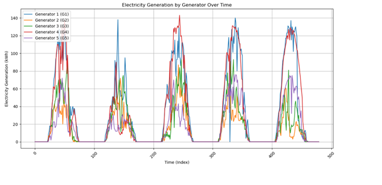
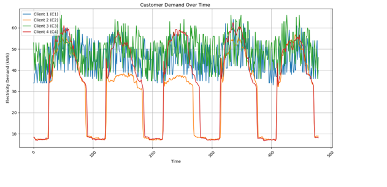
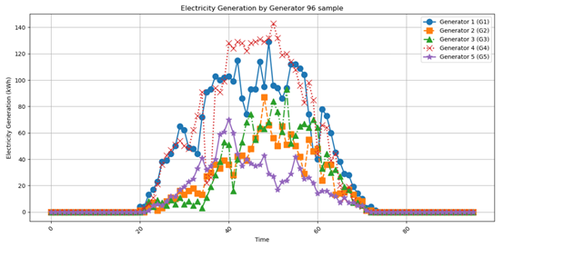
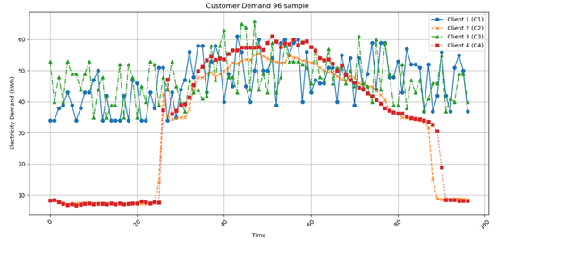
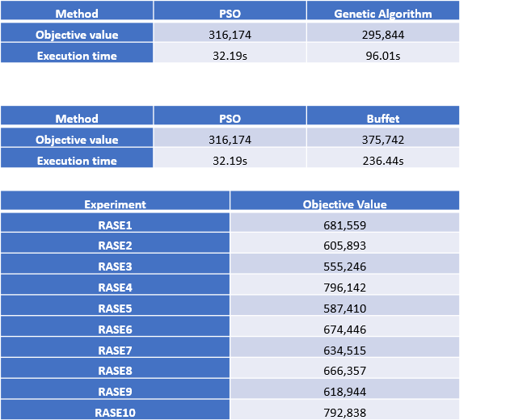

# Project-solar
 Allocation Optimization

The objective is to utilize Particle Swarm Optimization (PSO) to find the optimal Percentage Generator Client (PGC) matrix, balancing solar energy supply and demand, reducing waste, and improving efficiency. By optimizing energy allocation, the aim is to enhance energy management and forecasting, promoting the effective use of renewable energy.

Objective: To find the optimal Percentage Generator Client (PGC) matrix. (The lower the objective function value, the better the PGC matrix)

Methods: Particle Swarm Optimization (PSO), Genetic Algorithm (GA), random matrix, and BUFFET.

Dataset: The data covers 24 hours with a unique data point every 15 minutes, totaling 2976 data points per dataset for 31 days.
# Dataset Visualization
Power Generation from Each Generator

Power Demand from Each Customer

Power Generation of Each Generator (96 Samples)

Power Demand from Each Customer (96 Samples)

# Result

Analysis of Optimization Methods and Random Allocation Results:

Comparison of Optimization Techniques:
1. Genetic Algorithm: This method achieved the best performance in terms of minimizing the objective value at 295,844. Despite its effectiveness, it has the longest execution time among the three specific optimization techniques at 96.01 seconds.
2. PSO (Particle Swarm Optimization): PSO, with an objective value of 316,174, did not perform as well as the Genetic Algorithm in minimizing the objective function but was considerably faster, completing in only 32.19 seconds. This efficiency makes it advantageous for scenarios requiring quicker results.
3. Buffet had the highest objective value among the three optimization methods at 375,742 and also the longest execution time at 236.44 seconds, indicating it may not be the most efficient choice for optimization in terms of both speed and effectiveness.
